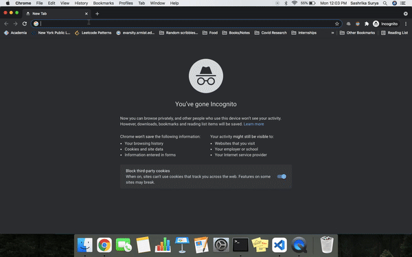

# BookStack

A RESTful shopping cart API which can create new users, add/update or delete items from cart.

## Tech Stack
- MongoDB
- Flask
- Python

## Usage Guidelines
- Clone the repository by pasting the following command in terminal
```
git clone https://github.com/sashrika15/bookstack.git
```
- Change directory to /bookstack
```
cd bookstack
```
- Install requirements
```
pip install -r requirements.txt
```
- Create a free account on cloud MongoDB [here](https://cloud.mongodb.com/). Create a free cluster and add database and collection names as follows:
  - Database: 
    - ecommerce
  - Collections:
    - users
    - products 
- Get the connection string URI string of your shared cluster and replace in line 7 of app.py and line 4 of prod_insert.py as follows:
```
cluster = MongoClient("<Your URI string>")
```
- Run the prod_insert.py file to insert products into your database
```
python prod_insert.py
```
- Run app file
```
python app.py
```
- Open any web browser and paste the following
```
localhost:5000
```

## Demo
<p align="center">

</p>

- New User registration 
<p align="center">

</p>

## Queries
- For queries, open an Issue or contact me via email.
